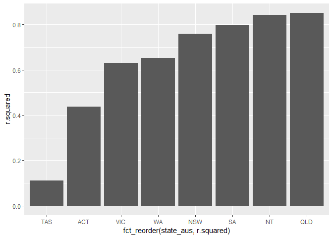

Australia state prison sentence
================
Bryan Shalloway
4/26/2019

``` r
library(tidyverse)
library(lubridate)
library(broom)
library(fpp2)
```

# Prep exmaple dataset

*Prep data used in examples:*

``` r
prison_df <- fpp2::prisonLF %>% 
  group_by(state, legal, t) %>% 
  summarise(count = sum(count)) %>% 
  ungroup() %>% 
  rename(state_aus = state, date_mo = t) %>% 
  select(state_aus, date_mo, legal, count) %>% 
  arrange(date_mo) %>% 
  spread(legal, count)
```

# List columns example

*Make custom lm function with formula specified:*

``` r
lm_prison <- function(df){
  lm(Sentenced ~ Remanded, data = df)
}
```

*Unnest evaluation metrics and plot:*

``` r
prison_df %>%
  group_by(state_aus) %>%
  nest() %>% print() %>% 
  mutate(models = map(data, lm_prison)) %>% print() %>% 
  mutate(eval_metrics = map(models, broom::glance)) %>% print() %>% 
  unnest(eval_metrics, .drop = TRUE) %>% print() %>% 
  ggplot(aes(x = fct_reorder(state_aus, r.squared),
             y = r.squared)) +
  geom_col()
```

    ## # A tibble: 8 x 2
    ##   state_aus data             
    ##   <fct>     <list>           
    ## 1 ACT       <tibble [48 x 3]>
    ## 2 NSW       <tibble [48 x 3]>
    ## 3 NT        <tibble [48 x 3]>
    ## 4 QLD       <tibble [48 x 3]>
    ## 5 SA        <tibble [48 x 3]>
    ## 6 TAS       <tibble [48 x 3]>
    ## 7 VIC       <tibble [48 x 3]>
    ## 8 WA        <tibble [48 x 3]>
    ## # A tibble: 8 x 3
    ##   state_aus data              models  
    ##   <fct>     <list>            <list>  
    ## 1 ACT       <tibble [48 x 3]> <S3: lm>
    ## 2 NSW       <tibble [48 x 3]> <S3: lm>
    ## 3 NT        <tibble [48 x 3]> <S3: lm>
    ## 4 QLD       <tibble [48 x 3]> <S3: lm>
    ## 5 SA        <tibble [48 x 3]> <S3: lm>
    ## 6 TAS       <tibble [48 x 3]> <S3: lm>
    ## 7 VIC       <tibble [48 x 3]> <S3: lm>
    ## 8 WA        <tibble [48 x 3]> <S3: lm>
    ## # A tibble: 8 x 4
    ##   state_aus data              models   eval_metrics     
    ##   <fct>     <list>            <list>   <list>           
    ## 1 ACT       <tibble [48 x 3]> <S3: lm> <tibble [1 x 11]>
    ## 2 NSW       <tibble [48 x 3]> <S3: lm> <tibble [1 x 11]>
    ## 3 NT        <tibble [48 x 3]> <S3: lm> <tibble [1 x 11]>
    ## 4 QLD       <tibble [48 x 3]> <S3: lm> <tibble [1 x 11]>
    ## 5 SA        <tibble [48 x 3]> <S3: lm> <tibble [1 x 11]>
    ## 6 TAS       <tibble [48 x 3]> <S3: lm> <tibble [1 x 11]>
    ## 7 VIC       <tibble [48 x 3]> <S3: lm> <tibble [1 x 11]>
    ## 8 WA        <tibble [48 x 3]> <S3: lm> <tibble [1 x 11]>
    ## # A tibble: 8 x 12
    ##   state_aus r.squared adj.r.squared sigma statistic  p.value    df logLik
    ##   <fct>         <dbl>         <dbl> <dbl>     <dbl>    <dbl> <int>  <dbl>
    ## 1 ACT           0.437        0.425   51.0     35.8  3.10e- 7     2  -256.
    ## 2 NSW           0.760        0.755  225.     146.   7.36e-16     2  -327.
    ## 3 NT            0.842        0.839   81.9    246.   4.39e-20     2  -279.
    ## 4 QLD           0.851        0.848  189.     263.   1.21e-20     2  -319.
    ## 5 SA            0.800        0.796  113.     184.   1.11e-17     2  -294.
    ## 6 TAS           0.111        0.0914  22.2      5.73 2.09e- 2     2  -216.
    ## 7 VIC           0.630        0.622  404.      78.3  1.71e-11     2  -355.
    ## 8 WA            0.652        0.644  317.      86.2  4.09e-12     2  -343.
    ## # ... with 4 more variables: AIC <dbl>, BIC <dbl>, deviance <dbl>,
    ## #   df.residual <int>

<!-- -->

  - print statements show output at each step for use in presentation

*Build dataframe and print particular elements:*

``` r
core_data <- prison_df %>% 
  group_by(state_aus) %>% 
  nest() %>% 
  mutate(models = map(data, lm_prison)) %>% 
  mutate(eval_metrics = map(models, broom::glance))

core_data %>% 
  pluck("data", 1)
```

    ## # A tibble: 48 x 3
    ##    date_mo    Remanded Sentenced
    ##    <date>        <dbl>     <dbl>
    ##  1 2005-03-01       67       111
    ##  2 2005-06-01       70       113
    ##  3 2005-09-01       64       123
    ##  4 2005-12-01       67       137
    ##  5 2006-03-01       64       126
    ##  6 2006-06-01       71       119
    ##  7 2006-09-01       61       104
    ##  8 2006-12-01       64       115
    ##  9 2007-03-01       63       109
    ## 10 2007-06-01       63        97
    ## # ... with 38 more rows

``` r
core_data %>% 
  pluck("models", 1)
```

    ## 
    ## Call:
    ## lm(formula = Sentenced ~ Remanded, data = df)
    ## 
    ## Coefficients:
    ## (Intercept)     Remanded  
    ##      -11.49         1.95

``` r
core_data %>% 
  pluck("eval_metrics", 1)
```

    ## # A tibble: 1 x 11
    ##   r.squared adj.r.squared sigma statistic p.value    df logLik   AIC   BIC
    ##       <dbl>         <dbl> <dbl>     <dbl>   <dbl> <int>  <dbl> <dbl> <dbl>
    ## 1     0.437         0.425  51.0      35.8 3.10e-7     2  -256.  518.  523.
    ## # ... with 2 more variables: deviance <dbl>, df.residual <int>

  - extract objects and paste into presentation

# Cluttered environment example

Run below and then take screenshot of “cluttered” environment for
presentation.

``` r
knitr::opts_chunk$set(eval = FALSE)
```

*Visualization:*

``` r
chart <- prison_df %>% 
  ggplot(aes(x = Remanded, y = Sentenced))+
  geom_point()
  # facet_wrap(~state_aus, scales = "free")

chart1 <- chart
chart2 <- chart
chart3 <- chart
chart4 <- chart
```

``` r
charts_mult <- prison_df %>% 
  ggplot(aes(x = Remanded, y = Sentenced, colour = state_aus))+
  geom_point()

map(1:8, 
     ~charts_mult +
      ggforce::facet_wrap_paginate(~state_aus, ncol = 1, nrow = 1, scales = "free", page = .x)+
      theme(legend.position = "none") 
     )
```

*Model:*

``` r
model <- lm(Sentenced ~ Remanded, data = prison_df)

model_simple %>% 
  summary()

model1 <- model
model2 <- model
model3 <- model
model4 <- model
```

``` r
valuation_metrics <- model %>% 
  broom::glance()

evaluation_metrics1 <- evaluation_metrics
evaluation_metrics2 <- evaluation_metrics
evaluation_metrics3 <- evaluation_metrics
evaluation_metrics4 <- evaluation_metrics
```
